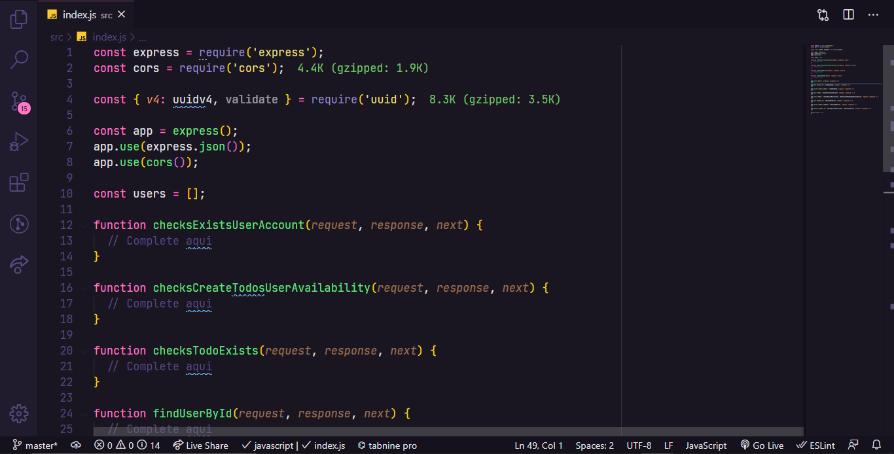

# Desafio 02 - Trabalhando com middlewares

<div align="center">
    

Este desafio faz parte da lista de desafios que compõem o curso de NodeJS. 

Visite à [Rockseat](https://rocketseat.com.br/) para saber mais sobre o curso.
</div>

<p align="center">
  

  <a href="https://rocketseat.com.br">
    
  </a>

  

  <a href="https://github.com/rocketseat-education/ignite-template-trabalhando-com-middlewares/stargazers">
    
  </a>
  
</p>

<p align="center">
  <a href="#rocket-sobre-o-desafio">Sobre o desafio</a>&nbsp;&nbsp;&nbsp;|&nbsp;&nbsp;&nbsp;
  <a href="#keyboard-instalação-e-execução-do-projeto">Instalação e Execução do Projeto</a>&nbsp;&nbsp;&nbsp;|&nbsp;&nbsp;&nbsp;
  <a href="#template-da-aplicação">Template da aplicação</a>&nbsp;&nbsp;&nbsp;|&nbsp;&nbsp;&nbsp;
  <a href="#rotas-da-aplicação-instruções">Rotas da aplicação</a>&nbsp;&nbsp;&nbsp;|&nbsp;&nbsp;&nbsp;
  <a href="#específicação-dos-testes-instruções">Específicação dos testes</a>&nbsp;&nbsp;&nbsp;|&nbsp;&nbsp;&nbsp;
  <a href="#memo-licença">Licença</a>
</p>


## :rocket: Sobre o desafio

Nesse desafio foi-se mais a fundo com middlewares no Express. 
Dessa foi capaz de fixar mais ainda os conhecimentos obtidos até agora.

Para facilitar um pouco mais do conhecimento da regra de negócio, foi usada a aplicação do desafio anterior: 
uma aplicação para gerenciar tarefas (ou *todos*) mas com algumas mudanças.

Será permitida a criação de um `user` com `name` e `username`,bem como fazer o CRUD de *todos*:

- Criar um novo *todo*;
- Listar todos os *todos*;
- Alterar o `title` e `deadline` de um *todo* existente;
- Marcar um *todo* como feito;
- Excluir um *todo*;

Tudo isso para cada `user` em específico. 
Além disso, dessa vez teremos um plano grátis onde o `user` só pode criar até dez *todos* e um plano Pro que irá permitir criar *todos* ilimitados, isso tudo usando middlewares para fazer as validações necessárias.

A seguir veremos com mais detalhes o que e como precisa ser feito 🚀

### :keyboard: Instalação e Execução do Projeto

- Clone o repositório

```
https://github.com/code36u4r60/ignite-desafio-trabalhando-com-middlewares.git
```

 ou 

```
git@github.com:code36u4r60/ignite-desafio-trabalhando-com-middlewares.git
```

ou

```
gh repo clone code36u4r60/ignite-desafio-trabalhando-com-middlewares
```

- Entrar na pasta do projeto

```
cd ignite-desafio-trabalhando-com-middlewares
```

- Instale as dependências com o Yarn

```
yarn
```

- Executar o projeto

```
yarn dev
```

- Para correr os testes

```
yarn test
```

Deve aparecer uma mensagem parecida com esta:

```
yarn run v1.22.5
$ jest
 PASS  src/__tests__/middlewares/findUserById.spec.js
 PASS  src/__tests__/users.spec.js
 PASS  src/__tests__/todos.spec.js
 PASS  src/__tests__/middlewares/checksTodoExists.spec.js
 PASS  src/__tests__/middlewares/checksExistsUserAccount.spec.js
 PASS  src/__tests__/middlewares/checksCreateTodosUserAvailability.spec.js

Test Suites: 6 passed, 6 total
Tests:       22 passed, 22 total
Snapshots:   0 total
Time:        1.47 s, estimated 2 s
Ran all test suites.
Done in 2.03s.
```


### Template da aplicação

Foi utilizado um modelo de template que possui o esqueleto do projeto.

O template pode ser encontrado na seguinte url: **[Acessar Template](https://github.com/rocketseat-education/ignite-template-trabalhando-com-middlewares)**

**Dica**: Caso não saiba utilizar repositórios do Github como template, utilize o guia em **[nosso FAQ](https://www.notion.so/ddd8fcdf2339436a816a0d9e45767664).**

Agora navegue até a pasta criada e abra no Visual Studio Code, lembre-se de executar o comando `yarn` no seu terminal para instalar todas as dependências, e você terá algo parecido com isso:

<p align="center">
  
</p>

### Rotas da aplicação (Instruções)

Documentação no Notion sobre as rotas e testes: **[Documentação API e Testes](https://www.notion.so/Desafio-02-Trabalhando-com-middlewares-4f89bf538c2e4ee291382b92bdc36790)**

Com o template já clonado e o arquivo `index.js` aberto, você deve completar onde não possui código com o código para atingir os objetivos de cada teste.
Nesse desafio não será necessário alterar o código de nenhuma rota, **apenas dos middlewares**. Os testes iram também testar o funcionamento das rotas mas o resultado depende apenas da dos middlewares.

Aqui teremos uma breve descrição do que cada middleware deve fazer e na seção [Especificação dos testes](https://www.notion.so/Desafio-02-Trabalhando-com-middlewares-4f89bf538c2e4ee291382b92bdc36790) você verá com mais detalhes o que precisa ser feito para satisfazer cada teste.

### checksExistsUserAccount

Esse middleware é responsável por receber o username do `user` pelo header e validar se existe ou não um `user` com o username passado. Caso exista, o `user` deve ser repassado para o request e a função next deve ser chamada.

### checksCreateTodosUserAvailability

Esse middleware deve receber o **`user`** já dentro do request e chamar a função next apenas se esse `user` ainda estiver no **plano grátis e ainda não possuir 10 *todos* cadastrados** ou se ele **já estiver com o plano Pro ativado**. 

### checksTodoExists

Esse middleware deve receber o **username** de dentro do header e o **id** de um *todo* de dentro de `request.params`. Você deve validar o `user`, validar que o `id` seja um uuid e também validar que esse `id` pertence a um *todo* do `user` informado.

Com todas as validações passando, o *todo* encontrado deve ser passado para o `request` assim como o `user` encontrado também e a função next deve ser chamada.

### findUserById

Esse middleware possui um funcionamento semelhante ao middleware `checksExistsUserAccount` mas a busca pelo `user` deve ser feita através do **id** de um `user` passado por parâmetro na rota. Caso o `user` tenha sido encontrado, o mesmo deve ser repassado para dentro do `request.user` e a função next deve ser chamada.

## Específicação dos testes (Instruções)

Em cada teste, tem uma breve descrição no que sua aplicação deve cumprir para que o teste passe.

Caso você tenha dúvidas quanto ao que são os testes, e como interpretá-los, dê uma olhada em **[nosso FAQ](https://www.notion.so/FAQ-Desafios-ddd8fcdf2339436a816a0d9e45767664)**

Para esse desafio, temos os seguintes testes:

### Testes dos middlewares

- **Should be able to find user by username in header and pass it to request.user**

    Para que esse teste passe, você deve permitir que o middleware **checksExistsUserAccount** receba um username pelo header do request e caso um `user` com o mesmo username exista, ele deve ser colocado dentro de `request.user` e, ao final, retorne a chamada da função `next`.

    Atente-se bem para o nome da propriedade que armazenará o objeto `user` no request.

- **Should not be able to find a non existing user by username in header**

    Para que esse teste passe, no middleware **checksExistsUserAccount** você deve retornar uma resposta com status `404` caso o username passado pelo header da requisição não pertença a nenhum `user`. Você pode também retornar uma mensagem de erro mas isso é opcional.

- **Should be able to let user create a new todo when is in free plan and have less than ten todos**

    Para que esse teste passe, você deve permitir que o middleware **checksCreateTodosUserAvailability** receba o objeto `user` (considere sempre que o objeto existe) da `request` e chame a função `next` somente no caso do `user` estar no **plano grátis e ainda não possuir 10 *todos* cadastrados** ou se ele **já estiver com o plano Pro ativado**.

    Você pode verificar se o `user` possui um plano Pro ou não a partir da propriedade `user.pro`. Caso seja `true` significa que o plano Pro está em uso.

- **Should not be able to let user create a new todo when is not Pro and already have ten todos**

    Para que esse teste passe, no middleware **checksCreateTodosUserAvailability** você deve retornar uma resposta com status `403` caso o `user` recebido pela requisição esteja no **plano grátis** e **já tenha 10 *todos* cadastrados**. Você pode também retornar uma mensagem de erro mas isso é opcional.

- **Should be able to let user create infinite new todos when is in Pro plan**

    Para que esse teste passe, você deve permitir que o middleware **checksCreateTodosUserAvailability** receba o objeto `user` (considere sempre que o objeto existe) da `request` e chame a função `next` caso o `user` já esteja com o plano Pro. 

    Se você satisfez os dois testes anteriores antes desse, ele já deve passar também.

- **Should be able to put user and todo in request when both exits**

    Para que esse teste passe, o middleware **checksTodoExists** deve receber o `username` de dentro do header e o `id` de um *todo* de dentro de `request.params`. Você deve validar que o `user` exista, validar que o `id` seja um uuid e também validar que esse `id` pertence a um *todo* do `user` informado.

    Com todas as validações passando, o *todo* encontrado deve ser passado para o `request` assim como o `user` encontrado também e a função next deve ser chamada.

    É importante que você coloque dentro de `request.user` o `user` encontrado e dentro de `request.todo` o *todo* encontrado.

- **Should not be able to put user and todo in request when user does not exists**

    Para que esse teste passe, no middleware **checksTodoExists** você deve retornar uma resposta com status `404` caso não exista um `user` com o `username` passado pelo header da requisição.

- **Should not be able to put user and todo in request when todo id is not uuid**

    Para que esse teste passe, no middleware **checksTodoExists** você deve retornar uma resposta com status `400` caso o `id` do *todo* passado pelos parâmetros da requisição não seja um UUID válido (por exemplo `1234abcd`).

- **Should not be able to put user and todo in request when todo does not exists**

    Para que esse teste passe, no middleware **checksTodoExists** você deve retornar uma resposta com status `404` caso o `id` do *todo* passado pelos parâmetros da requisição não pertença a nenhum *todo* do `user` encontrado.

- **Should be able to find user by id route param and pass it to request.user**

    Para que esse teste passe, o middleware **findUserById** deve receber o `id` de um `user` de dentro do `request.params`. Você deve validar que o `user` exista, repassar ele para `request.user` e retornar a chamada da função next.

- **Should not be able to pass user to request.user when it does not exists**

    Para que esse teste passe, no middleware **findUserById** você deve retornar uma resposta com status `404` caso o `id` do `user` **passado pelos parâmetros da requisição não pertença a nenhum `user` cadastrado.

---

Todos os demais testes são os mesmos testes encontrados no desafio 01 com algumas (ou nenhuma) mudanças.

 Vale reforçar que esse desafio é focado apenas em middlewares e você não precisa modificar o conteúdo das rotas para que os testes passem 💜


## :memo: Licença

Esse projeto está sob a licença MIT. Veja o arquivo [LICENSE](https://github.com/git/git-scm.com/blob/master/MIT-LICENSE.txt) para mais detalhes.

---

Created with 💜 by <a href="https://www.linkedin.com/in/eduardoqueiros/">Eduardo Queirós</a> :wave:
